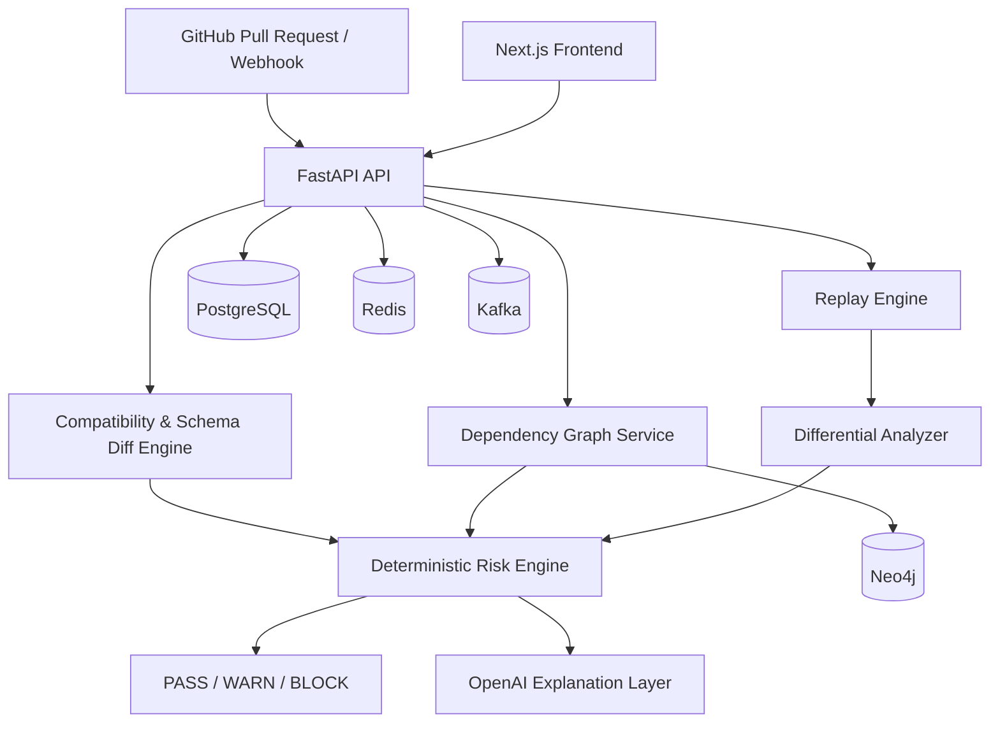

# AgentABI

**Agent Compatibility & Upgrade Intelligence Platform**

AgentABI is a production-style platform for determining whether a change to an AI-agent system is safe to deploy.

It analyzes changes to models, prompts, tools, MCP servers, schemas, APIs, policies, providers, and workflows before they reach production.

The core principle is simple:

> **Deterministic software makes the compatibility decision. The LLM only explains the evidence.**

AgentABI does not send raw logs to an LLM and ask it to guess whether a deployment is safe. Compatibility analysis, dependency traversal, replay comparison, risk scoring, and the final `PASS`, `WARN`, or `BLOCK` decision are performed by deterministic application logic.

---

## Why AgentABI

Modern agent systems can fail when seemingly small changes alter:

- tool input/output schemas
- prompts or model behavior
- APIs and provider contracts
- MCP tools or servers
- workflow dependencies
- authorization policies
- downstream assumptions

Traditional unit tests often do not capture the full impact of those changes.

AgentABI combines structural compatibility analysis with dependency graphs and historical execution replay to answer:

**What changed, what can it affect, how did behavior change, and is the deployment safe?**

---

## Core Pipeline

```text
GitHub Pull Request
        |
        v
Change Detection
        |
        v
Baseline vs Candidate Configuration
        |
        v
Deterministic Schema / Configuration Diff
        |
        v
Neo4j Dependency Graph + Blast Radius
        |
        v
Historical Trajectory Selection
        |
        v
Baseline Replay / Candidate Replay
        |
        v
Differential Analysis
        |
        v
Deterministic Risk Engine
        |
        +------> PASS / WARN / BLOCK
        |
        v
LLM Evidence Explanation
        |
        v
GitHub / UI Result
```

---

## Architecture



---

## Major Capabilities

- Component registry for agent-system dependencies
- Deterministic schema normalization and compatibility diffing
- Neo4j dependency graph and blast-radius analysis
- Historical trajectory storage
- Deterministic replay engine
- Baseline-versus-candidate differential analysis
- Deterministic risk scoring and `PASS/WARN/BLOCK` decisions
- OpenAI explanation layer over already-computed evidence
- GitHub OAuth2 authentication
- Organization/project RBAC with `OWNER`, `ADMIN`, and `MEMBER` roles
- Multi-tenant authorization boundaries
- GitHub webhook signature verification
- Redis-backed rate limiting
- Structured audit logging
- Correlation IDs and security headers
- OpenTelemetry tracing support
- Prometheus metrics and Grafana dashboards
- React Flow dependency visualization
- Production Docker images
- Helm Kubernetes deployment
- Terraform infrastructure
- GitHub Actions CI/CD and security scanning

---

## Technology Stack

### Backend

- Python 3.12
- FastAPI
- Pydantic
- SQLAlchemy
- Alembic
- asyncio / httpx
- OpenAI API

### Data and Messaging

- PostgreSQL
- Neo4j
- Redis
- Kafka

### Frontend

- Next.js
- React
- TypeScript
- TanStack Query
- React Flow
- Recharts
- Tailwind CSS

### Cloud and Platform

- Google Kubernetes Engine Autopilot
- Google Cloud SQL
- Google Artifact Registry
- Google Secret Manager
- Google Cloud VPC
- Terraform
- Helm
- Docker
- GitHub Actions
- Workload Identity Federation

The repository also contains the earlier AWS infrastructure design using EKS, RDS, ElastiCache, MSK, ECR, IAM, and related Terraform modules.

---

## On-Demand Recruiter Demo

The GCP environment is intentionally designed to be started only when a live demo is required instead of remaining online continuously.

### Start the demo

```bash
cd /Users/lavaneshthirukondamahendran/Desktop/AgentABI
./scripts/gcp-demo-up.sh
```

The startup workflow:

1. starts Cloud SQL
2. reconciles Terraform-managed infrastructure
3. recreates the GKE Autopilot cluster when necessary
4. restores runtime secrets from Secret Manager
5. deploys AgentABI with Helm
6. waits for the application workloads
7. waits for the external load balancer
8. verifies the public readiness endpoint

A cold start can take several minutes because GKE and the external load balancer may need to be recreated.

### Check demo status

```bash
./scripts/gcp-demo-status.sh
```

### Stop the demo

```bash
./scripts/gcp-demo-down.sh --yes
```

The shutdown workflow removes the public ingress, deletes the GKE demo cluster, and stops Cloud SQL while preserving database storage.

This lets the demo stay offline when it is not needed.

---

## CI/CD

The repository contains:

```text
.github/workflows/ci.yml
.github/workflows/deploy.yml
```

CI validates the backend, frontend, Terraform, container builds, and security checks.

The GCP deployment workflow uses:

```text
GitHub Actions
      |
      v
OIDC / Workload Identity Federation
      |
      v
Google Cloud
      |
      +--> Artifact Registry
      |
      +--> GKE
      |
      +--> Secret Manager
      |
      +--> Cloud SQL
```

No long-lived Google Cloud service-account JSON key is required by the deployment pipeline.

---

## Security Model

AgentABI includes:

- GitHub OAuth2 login
- Signed AgentABI JWTs
- Organization/project RBAC
- Tenant-scoped authorization
- Webhook HMAC-SHA256 verification
- Redis rate limiting
- Request-size controls
- CORS and security headers
- Correlation IDs
- Append-only audit events
- Secret storage outside source control
- Automated Gitleaks scanning
- Trivy filesystem/IaC scanning

Cross-tenant resources intentionally return `404` rather than revealing that another tenant's resource exists.

See [`docs/SECURITY_VERIFICATION.md`](docs/SECURITY_VERIFICATION.md).

---

## Observability

AgentABI supports:

- structured JSON logging
- OpenTelemetry distributed tracing
- Prometheus application metrics
- Grafana dashboards
- API and worker instrumentation

Tracing can be disabled independently of metrics.

---

## Local Development

Create the environment:

```bash
cp .env.example .env
make install
make infra-up
make migrate
make run
```

Backend quality checks:

```bash
make fmt
make lint
make typecheck
make test
```

A Docker-based Python 3.12 test path is also available:

```bash
make infra-up
docker compose run --rm test
```

---

## Frontend Development

```bash
cp frontend/.env.example frontend/.env.local
cd frontend
npm install
npm run dev
```

Validation:

```bash
npm run lint
npm run typecheck
npm test
npm run build
```

---

## Health Endpoints

Process health:

```text
GET /api/v1/health
```

Dependency readiness:

```text
GET /api/v1/ready
```

The readiness endpoint verifies required runtime dependencies such as PostgreSQL, Neo4j, and Kafka.

---

## API Documentation

When running locally, FastAPI Swagger documentation is available at:

```text
/docs
```

A Postman collection and usage instructions are available in:

```text
postman/
docs/POSTMAN.md
```

---

## Repository Structure

```text
AgentABI/
├── backend/                  FastAPI application and deterministic engines
├── frontend/                 Next.js web application
├── deploy/helm/agentabi/     Kubernetes Helm chart
├── infra/terraform/          AWS infrastructure
├── infra/terraform/gcp/      GCP recruiter-demo infrastructure
├── docs/                     Architecture, ADRs, security and runbooks
├── scripts/                  Operational demo scripts
├── postman/                  API collection and environment
├── .github/workflows/        CI/CD pipelines
└── docker-compose.yml        Local infrastructure
```

---

## Engineering Documentation

Detailed design information is available in:

- [`docs/PROJECT_SPEC.md`](docs/PROJECT_SPEC.md)
- [`docs/ARCHITECTURE.md`](docs/ARCHITECTURE.md)
- [`docs/DECISIONS.md`](docs/DECISIONS.md)
- [`docs/ROADMAP.md`](docs/ROADMAP.md)
- [`docs/SECURITY_VERIFICATION.md`](docs/SECURITY_VERIFICATION.md)
- [`docs/INTERVIEW_NOTES.md`](docs/INTERVIEW_NOTES.md)
- [`docs/POSTMAN.md`](docs/POSTMAN.md)

---

## Design Invariant

AgentABI's most important architectural boundary is:

```text
Deterministic analysis
    -> produces evidence
    -> calculates risk
    -> decides PASS/WARN/BLOCK

LLM
    -> receives structured evidence
    -> explains the result
```

The language model does **not** calculate compatibility, dependency edges, replay metrics, risk scores, or deployment decisions.

That separation keeps the safety decision reproducible, testable, and independent of the explanation model.
