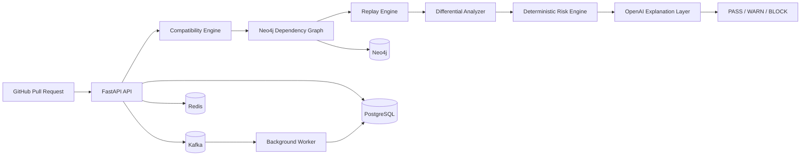

# AgentABI

**Agent Compatibility & Upgrade Intelligence Platform**

AgentABI is a production-style platform for evaluating whether changes to AI-agent systems are safe to deploy.

It analyzes changes to models, prompts, tools, schemas, APIs, and workflows using deterministic compatibility checks, dependency analysis, historical trajectory replay, differential analysis, and deployment risk evaluation.

The system is intentionally designed so that **LLMs explain evidence but never decide compatibility or deployment safety**.

---

## Why AgentABI

Modern AI-agent systems depend on more than model output. They also depend on:

- tool schemas
- API contracts
- prompt formats
- workflow assumptions
- shared state
- service dependencies
- historical execution behavior

A small change to one component can break another component several steps away.

AgentABI is built to answer:

> **Can this change be deployed safely, and what evidence supports that decision?**

---

## Core Workflow

```text
GitHub Pull Request
        |
        v
Change Detection
        |
        v
Baseline + Candidate Configuration
        |
        v
Deterministic Schema / Config Diff
        |
        v
Dependency Graph + Blast Radius
        |
        v
Historical Trajectory Selection
        |
        v
Baseline Replay + Candidate Replay
        |
        v
Differential Analysis
        |
        v
Deterministic Risk Engine
        |
        v
LLM Evidence Explanation
        |
        v
PASS / WARN / BLOCK
```

The final deployment decision is produced by deterministic software.

The LLM is used only after the system has already produced structured evidence.

---

## Architecture



---

## Major Capabilities

### Compatibility Analysis

AgentABI normalizes and compares baseline and candidate configurations to identify:

- breaking schema changes
- field additions and removals
- type changes
- required-field changes
- interface incompatibilities
- tool and API contract drift

This logic is deterministic and does not depend on an LLM.

### Dependency Graph and Blast Radius

Neo4j stores relationships between components and allows AgentABI to determine which downstream systems may be affected by a change.

The platform can trace dependencies across:

- agents
- tools
- prompts
- services
- APIs
- models
- workflows

### Historical Trajectory Replay

AgentABI records execution trajectories and replays them against both baseline and candidate configurations.

This allows the platform to compare actual behavioral outcomes rather than relying only on static configuration checks.

### Differential Analysis

Replay outputs are compared to identify meaningful behavioral changes such as:

- changed tool calls
- changed outputs
- failed transitions
- changed execution paths
- state differences
- unexpected behavior

### Deterministic Risk Engine

Structured evidence from compatibility analysis, graph impact, and replay differences is evaluated by a deterministic risk engine.

The system produces one of three outcomes:

- `PASS`
- `WARN`
- `BLOCK`

The LLM does not assign the risk score or final decision.

### Evidence Explanation

OpenAI is used only to explain already-computed evidence in clear language.

This keeps the platform auditable and avoids using an LLM as the source of truth for deployment safety.

---

## Technology Stack

### Backend

- Python 3.12+
- FastAPI
- Pydantic
- SQLAlchemy
- Alembic
- asyncio
- httpx

### Data and Messaging

- PostgreSQL
- Redis
- Neo4j
- Apache Kafka

### AI

- OpenAI API
- provider abstraction
- deterministic evidence pipeline before LLM explanation

### Frontend

- Next.js
- React
- TypeScript
- Tailwind CSS
- TanStack Query
- React Flow
- Recharts

### Cloud and DevOps

- Amazon Web Services (AWS)
- Amazon Elastic Kubernetes Service (EKS)
- Amazon RDS for PostgreSQL
- Amazon Elastic Container Registry (ECR)
- AWS Secrets Manager
- Terraform
- Helm
- Docker
- GitHub Actions
- GitHub Actions OIDC and IAM Roles for Service Accounts (IRSA)

### Observability

- OpenTelemetry
- Prometheus
- Grafana
- structured logging
- health and readiness endpoints

---

## AWS Recruiter Demo

AgentABI runs on AWS using Amazon EKS, Amazon RDS for PostgreSQL, Amazon ElastiCache for Valkey, Amazon ECR, AWS Secrets Manager, Apache Kafka, Neo4j, the API, worker, and Next.js frontend.

### Start / Restore the Demo

    ./scripts/aws-demo-up.sh

### Check Status

    ./scripts/aws-demo-status.sh

### Pause Demo Workloads

    ./scripts/aws-demo-down.sh --yes

The down script scales Kubernetes workloads to zero while preserving persistent data and provisioned AWS infrastructure. AWS resources may continue to incur charges.

---

## CI/CD

GitHub Actions validates the repository before merge.

The pipeline includes:

- backend linting
- formatting validation
- static type checking
- automated tests
- frontend linting
- TypeScript validation
- frontend unit tests
- production build verification
- Docker production image builds
- Terraform formatting and validation
- secret scanning
- dependency vulnerability scanning
- infrastructure misconfiguration scanning

AWS deployment uses **GitHub Actions OIDC** to assume a scoped IAM deploy role instead of storing long-lived AWS access keys in GitHub.

---

## Security

AgentABI includes multiple security controls:

- JWT authentication
- GitHub OAuth
- organization-aware RBAC
- OWNER / ADMIN / MEMBER permissions
- signed webhook verification
- rate limiting
- request-size limits
- CORS configuration
- security headers
- correlation IDs
- audit logging
- AWS Secrets Manager integration
- private Amazon RDS networking
- CI secret scanning
- dependency vulnerability scanning
- infrastructure security checks

---

## Local Development

### Requirements

- Python 3.12+
- Node.js
- Docker
- Docker Compose

### Start Infrastructure

```bash
docker compose up -d
```

### Backend

```bash
cd backend
python -m venv .venv
source .venv/bin/activate
pip install -e ".[dev]"
```

Run the API:

```bash
uvicorn agentabi.main:app --reload
```

### Frontend

```bash
cd frontend
npm ci
npm run dev
```

---

## Health Endpoints

```text
GET /api/v1/health
GET /api/v1/ready
```

The readiness endpoint verifies required dependencies such as the database, graph layer, and event infrastructure.

---

## Repository Structure

```text
AgentABI/
├── backend/
│   ├── agentabi/
│   ├── alembic/
│   └── tests/
├── frontend/
├── deploy/
│   └── helm/
├── infra/
│   └── terraform/
│       ├── bootstrap/
│       ├── environments/
│       │   └── dev/
│       └── modules/
├── observability/
├── scripts/
├── docs/
├── postman/
├── docker-compose.yml
└── README.md
```

---

## Engineering Documentation

The repository includes supporting technical documentation:

- `docs/PROJECT_SPEC.md`
- `docs/ARCHITECTURE.md`
- `docs/DECISIONS.md`
- `docs/ROADMAP.md`
- `docs/INTERVIEW_NOTES.md`
- `docs/POSTMAN.md`
- `docs/SECURITY_VERIFICATION.md`

---

## Design Principle

AgentABI follows one strict rule:

> **Deterministic software decides. LLMs explain.**

Compatibility, dependency analysis, replay results, differential analysis, risk evaluation, and the final `PASS / WARN / BLOCK` outcome are produced by deterministic application logic.

This keeps the system reproducible, testable, and auditable.

---

## What This Project Demonstrates

AgentABI was built to demonstrate practical engineering across several areas:

- backend system design
- distributed systems
- event-driven architecture
- graph-based dependency analysis
- deterministic replay
- AI infrastructure
- API security
- cloud deployment
- infrastructure as code
- Kubernetes
- CI/CD
- observability
- production-oriented testing

The project is structured as an engineering platform rather than a simple chatbot or API wrapper.

---

## Status

Core platform functionality, security hardening, CI validation, frontend integration, and the AWS EKS deployment workflow are implemented.

The cloud demo is kept offline when not in use and can be started for demonstrations using the provided lifecycle scripts.
